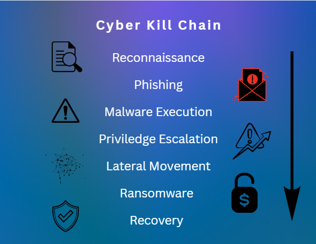

# Enterprise Ransomware Incident Response & Cyber Risk Analytics Case Study

## Overview

This project is a simulated enterprise ransomware case study focused on cybersecurity incident response, SOC workflows, cyber risk analysis, and business impact assessment.

The objective of this project was to analyze how a ransomware attack could affect enterprise operations, security posture, and organizational resilience from both cybersecurity and business risk perspectives.

---

# Key Focus Areas

- SOC Operations & Incident Response
- Cybersecurity Risk Assessment
- Business Impact Analysis
- Threat Detection Concepts
- Ransomware Attack Lifecycle
- Cyber Kill Chain Methodology
- MITRE ATT&CK Framework
- Enterprise Security Governance

---

# Included in This Project

- Enterprise ransomware case study report
- Cyber Kill Chain infographic
- Cybersecurity risk analysis
- Business impact assessment
- MITRE ATT&CK mapping
- Risk mitigation recommendations

---

---

# Cyber Kill Chain

  

---
# Disclaimer

This is a simulated cybersecurity case study created for educational and portfolio purposes. The organization, attack scenario, and operational details used in this project are hypothetical and designed to demonstrate cybersecurity analysis, risk assessment, and incident response concepts.

---

# Skills Demonstrated

- Cybersecurity Risk Assessment
- Incident Response Analysis
- SOC Workflow Understanding
- Business Risk Evaluation
- Threat Lifecycle Analysis
- Cyber Kill Chain Analysis
- MITRE ATT&CK Mapping
- Enterprise Security Strategy

---

# Career Alignment

This project aligns with roles such as:
- SOC Analyst
- Cybersecurity Risk Analyst
- Security Operations Analyst
- GRC Analyst
- Cyber Risk Consultant
- Business Cybersecurity Analyst
